# aidrama-studio

AI-powered novel-to-video production platform. Accepts novel text input and orchestrates a multi-stage pipeline (text analysis, screenplay conversion, storyboard generation, image/video/voice synthesis) to produce promotional video content.

## Architecture Overview

- **Framework**: Next.js 15 (App Router, Turbopack) + React 19
- **Language**: TypeScript (strict mode)
- **Database**: MySQL 8.0 via Prisma ORM
- **Queue**: BullMQ on Redis 7 (4 worker pools: image, video, voice, text)
- **Storage**: MinIO / S3-compatible object storage (pluggable: local, COS)
- **Auth**: NextAuth v4, credentials provider, JWT sessions, bcrypt passwords
- **i18n**: next-intl, locales: zh (default), en
- **Styling**: Tailwind CSS v4, Glass design system primitives
- **Testing**: Vitest, multi-tier (unit / integration / system / regression / concurrency)
- **CI/CD**: GitHub Actions (Docker multi-arch build), Husky pre-commit/pre-push gates
- **Deployment**: Docker Compose (MySQL + Redis + MinIO + App), Caddy for HTTPS, Mac Mini deploy via `scripts/deploy-to-mini.sh`

```mermaid
graph TD
    ROOT["aidrama-studio"] --> SRC["src/"]
    ROOT --> TESTS["tests/"]
    ROOT --> PRISMA["prisma/"]
    ROOT --> LIB_PROMPTS["lib/prompts/"]
    ROOT --> SCRIPTS["scripts/"]
    ROOT --> STANDARDS["standards/"]
    ROOT --> MESSAGES["messages/"]
    ROOT --> FEATURES["src/features/"]

    SRC --> APP["app/ (pages + API routes)"]
    SRC --> COMPONENTS["components/ (shared UI)"]
    SRC --> LIB["lib/ (core logic)"]

    APP --> API["api/ (120+ REST routes)"]
    APP --> PAGES["[locale]/ (pages)"]

    API --> API_NP["studio/ (68 routes)"]
    API --> API_AH["asset-hub/ (27 routes)"]
    API --> API_ASSETS["assets/ (7 routes)"]
    API --> API_USER["user/ (12 routes)"]
    API --> API_PROJECTS["projects/ (5 routes)"]
    API --> API_TASKS["tasks/ (3 routes)"]
    API --> API_RUNS["runs/ (5 routes)"]
    API --> API_AUTH["auth/ (2 routes)"]

    LIB --> WORKERS["workers/ (4 pools, 50+ handlers)"]
    LIB --> BILLING_LIB["billing/ (freeze-settle ledger)"]
    LIB --> GENERATORS["generators/ (image/video/audio)"]
    LIB --> LLM["llm/ (multi-provider gateway)"]
    LIB --> TASK_LIB["task/ (queue + SSE)"]
    LIB --> STORAGE_LIB["storage/ (MinIO/local/COS)"]
    LIB --> MEDIA["media/ (object lifecycle)"]
    LIB --> ASSETS_LIB["assets/ (registry + services)"]
    LIB --> LOGGING["logging/ (structured, semantic)"]
    LIB --> AI_RUNTIME["ai-runtime/ (step executor)"]
    LIB --> MODEL_GW["model-gateway/ (router)"]
    LIB --> LIPSYNC["lipsync/ (bailian/fal/vidu)"]
    LIB --> ASSISTANT["assistant-platform/"]

    FEATURES --> VIDEO_EDITOR["video-editor/ (Remotion)"]

    click WORKERS "./src/lib/workers/CLAUDE.md" "Workers module"
    click BILLING_LIB "./src/lib/billing/CLAUDE.md" "Billing module"
    click GENERATORS "./src/lib/generators/CLAUDE.md" "Generators module"
```



## Module Index

| Module | Path | Description |
|--------|------|-------------|
| API Routes (studio) | `src/app/api/studio/` | 68 REST endpoints for the core pipeline |
| API Routes (asset-hub) | `src/app/api/asset-hub/` | 27 endpoints for global asset CRUD |
| API Routes (user) | `src/app/api/user/` | 12 endpoints for user config, balance, costs |
| API Routes (assets) | `src/app/api/assets/` | 7 endpoints for project-scoped asset operations |
| API Routes (projects) | `src/app/api/projects/` | 5 endpoints for project CRUD |
| API Routes (runs) | `src/app/api/runs/` | 5 endpoints for workflow graph runs |
| API Routes (tasks) | `src/app/api/tasks/` | 3 endpoints for task lifecycle |
| Workers | `src/lib/workers/` | BullMQ worker pools (image, video, voice, text) with 50+ handlers |
| Billing | `src/lib/billing/` | Freeze-settle billing ledger with shadow/enforce modes |
| Generators | `src/lib/generators/` | Multi-provider media generation (Fal, Ark, Google, OpenAI-compat, Bailian, SiliconFlow) |
| LLM | `src/lib/llm/` | Multi-provider LLM gateway (chat/stream/vision) |
| Model Gateway | `src/lib/model-gateway/` | Model routing and OpenAI-compatible protocol adapter |
| Task System | `src/lib/task/` | Task lifecycle, queue, SSE publisher, submitter |
| Storage | `src/lib/storage/` | Pluggable object storage (MinIO, local, COS) |
| Media | `src/lib/media/` | Media object lifecycle, URL normalization, outbound image handling |
| Assets | `src/lib/assets/` | Asset registry, grouping, mappers, services |
| AI Runtime | `src/lib/ai-runtime/` | AI step execution abstraction layer |
| Logging | `src/lib/logging/` | Structured logging with semantic actions, redaction |
| Lipsync | `src/lib/lipsync/` | Lip-sync providers (Bailian, Fal, Vidu) |
| Assistant Platform | `src/lib/assistant-platform/` | In-app AI assistant with skills framework |
| Video Editor | `src/features/video-editor/` | Remotion-based timeline video editor |
| Shared Components | `src/components/` | UI primitives (Glass design system), modals, selectors |
| Prompts | `lib/prompts/` | AI prompt templates (zh/en), studio + character-reference |
| Tests | `tests/` | Multi-tier test suite (unit/integration/system/regression/concurrency) |
| Standards | `standards/` | Capability catalog, pricing catalog, prompt canary checks |
| Scripts & Guards | `scripts/` | 30+ guard scripts, migration scripts, operational tools |

## Run & Develop

```bash
# Prerequisites: Node 22.14.0 (see .nvmrc), Docker for MySQL/Redis/MinIO

# 1. Start infrastructure
docker compose up -d mysql redis minio

# 2. Install and setup
npm install
cp .env.example .env   # edit as needed
npx prisma db push

# 3. Development (all services in parallel)
npm run dev
# Starts: Next.js (turbopack :3000), Worker, Watchdog, Bull Board (:3010)

# 4. Production (Docker one-click)
docker compose up -d
# App: http://localhost:23000, Bull Board: http://localhost:23010
```

### Key Scripts

| Command | Purpose |
|---------|---------|
| `npm run dev` | Start all development services |
| `npm run build` | Production build (Prisma generate + Next.js build) |
| `npm run start` | Production start (all services) |
| `npm run typecheck` | TypeScript type checking |
| `npm run lint:all` | ESLint full scan |
| `npm run test:all` | Full test suite (guards + unit + integration + system + regression) |
| `npm run test:unit:all` | Unit tests only |
| `npm run test:billing` | Billing test suite with coverage |
| `npm run test:guards` | Static analysis guard scripts |
| `npm run test:pr` | Full regression suite for PR validation |
| `npm run verify:commit` | Pre-commit gate: lint + typecheck + test:all |
| `npm run verify:push` | Pre-push gate: lint + typecheck + test:all + build |

## Testing Strategy

- **Framework**: Vitest with v8 coverage provider
- **Tiers**:
  - `tests/unit/` -- Pure logic tests (no DB, mocked deps). `BILLING_TEST_BOOTSTRAP=0`
  - `tests/integration/` -- API contract tests, provider tests, chain tests, billing, task (real DB via `BILLING_TEST_BOOTSTRAP=1`)
  - `tests/system/` -- End-to-end workflows (image, video, text, voice generation)
  - `tests/regression/` -- Specific bug regression cases
  - `tests/concurrency/` -- Billing ledger concurrency safety
  - `tests/contracts/` -- Requirements matrix, route/task-type catalogs
- **Guards** (`scripts/guards/`): 25+ static analysis scripts (some renamed from `check:*` to `guard:*`):
  - API route contract compliance
  - No direct LLM calls from API routes
  - No hardcoded model capabilities
  - Prompt i18n parity (zh/en)
  - Test coverage thresholds by route and task type
  - File line count limits
- **Coverage**: Billing module enforced at 80% branches/functions/lines/statements
- **Hooks**: Husky pre-commit runs `verify:commit`, pre-push runs `verify:push`

## Coding Standards

- **TypeScript strict mode** with path alias `@/` mapping to `src/`
- **ESLint**: next/core-web-vitals, `no-explicit-any: off`, `no-unused-vars: warn`
- **Model keys**: Always `provider::modelId` format (no provider guessing)
- **Config priority**: project config > user preferences > null (no defaults)
- **Storage**: All media through `MediaObject` table with `storageKey` references
- **Error handling**: Structured error codes (`src/lib/errors/`), semantic logging
- **API auth**: `getRequiredSession()` in every API route, JWT validation
- **Logging**: Unified structured logger with field redaction, audit trail
- **File limits**: Enforced by `file-line-count-guard.mjs`
- **Prompts**: Bilingual (zh/en) `.txt` files in `lib/prompts/`, canary tests for JSON output format

## AI Usage Guidelines

- When modifying API routes, run `npm run check:api-handler` to validate contract compliance
- When changing prompts, run `npm run check:prompt-i18n` and `npm run check:prompt-json-canary`
- When modifying billing logic, run `npm run test:billing` to verify coverage thresholds
- When adding new task types, update `src/lib/task/types.ts` TASK_TYPE enum and add corresponding worker handler
- When adding new model providers, implement generator in `src/lib/generators/` and register in factory
- Model key format is always `provider::modelId` -- never construct raw provider strings
- Guard scripts are the source of truth for architecture rules -- read them before making structural changes
- Test files must follow the naming convention: `*.test.ts` for unit, `*.integration.test.ts`, `*.system.test.ts`

## Deployment

### Local Docker
```bash
docker compose up -d
# App: http://localhost:23000
# Bull Board: http://localhost:23010
# MySQL: localhost:23306
# Redis: localhost:26379
# MinIO: localhost:29000 (console: 29001)
```

### Mac Mini (Production)
```bash
./scripts/deploy-to-mini.sh
# Builds image locally → transfers to Mac Mini → restarts services
# Access: http://<your-server-ip>:23000
# SSH: <your-ssh-user>@<your-server-ip>
```

### Docker Build Notes
- Base image: `node:20-alpine` (all 3 stages: install/build/production)
- `package-lock.json` generated on macOS may lack Linux ARM64 platform deps
- If Docker build fails with `@parcel/watcher-linux-arm64-musl` error, regenerate lock file inside a Linux container or add explicit install in Dockerfile

## Changelog

| Date | Action |
|------|--------|
| 2026-04-06 | Fork decoupling: P0-P5 completed, landing page hero redesign |
| 2026-04-01 | Initial CLAUDE.md generated by architecture scan |
